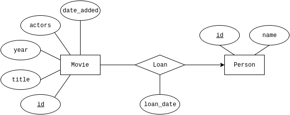

# Assignment 3 - 2dv513

Pär Eriksson (pe222gq)

## Personal Movie Inventory

We have a lot of movies and DVDs, and family members and friends are borrowing from time to time, and we have a tedency to forget who has what movie. It has happened on several occasions that we have bought movies we already have, and one time we wanted to see a movie we had lent out, but we couldn’t remember to who. So we bought that movie again, and three weeks later my brothers wife returns that very movie.

So I’ve had this idea for awhile to create a simple web based system to keep an inventory of our movies where friends and family can see what we have and borrow from us, and we have know exactly where all are movies are. So I figured that I could create a version of that system for this assignment.

## Logical model

E/R Diagram of the database



## Instructions

### Setup and launch the application

```bash
npm install

npm start

# Press 'Ctrl+C' to quit

```

### MongoDB instead of SQLite

If you want to use MongoDB instead of SQLite, you need to install MongoDB on your system and set it up so the application can access it (in `data/mongodb.js` change the `dbHost` to work with your installation).

Change the line `const USE_SQL = true` in `main.js` to `false`, then restart the server.

To populate the database, run the following command from the project root.

```bash
npm run setup-mongodb
```

### Empty database

If you want an empty database remove the file `data/pmi-data.sqlite` and then run:

```bash
npm run setup-sqlite
```
